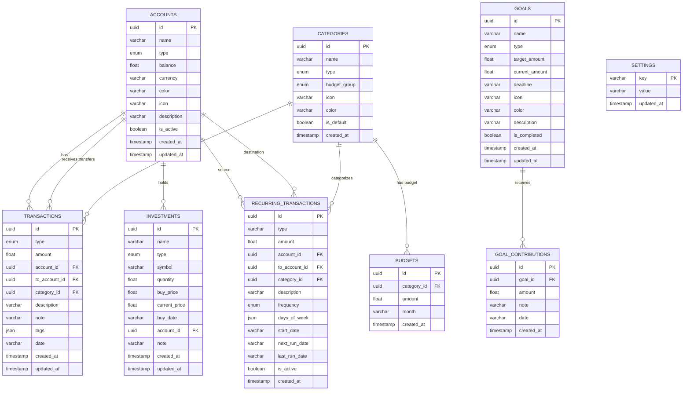

# 🗄 Database Schema — WealthLog

## Mục Lục

- [Tổng Quan](#tổng-quan)
- [Entity Relationship Diagram](#entity-relationship-diagram)
- [Tables](#tables)
  - [accounts](#accounts)
  - [transactions](#transactions)
  - [categories](#categories)
  - [budgets](#budgets)
  - [goals](#goals)
  - [goal_contributions](#goal_contributions)
  - [investments](#investments)
  - [recurring_transactions](#recurring_transactions)
  - [settings](#settings)
- [Enums](#enums)
- [Base Mixins](#base-mixins)
- [Indexing](#indexing)
- [Migrations](#migrations)
- [Seed Data](#seed-data)

---

## Tổng Quan

- **Database Engine:** PostgreSQL 16 (Alpine)
- **ORM:** SQLAlchemy 2.0 (Async mode)
- **Driver:** asyncpg
- **Migration Tool:** Alembic
- **ID Strategy:** UUID v4
- **Date Format:** ISO 8601 string (`YYYY-MM-DD`) stored as `VARCHAR(10)`
- **Timezone:** Server-side timestamps use `DateTime(timezone=True)` with `func.now()`

---

## Entity Relationship Diagram



---

## Tables

### accounts

Quản lý tài khoản tài chính.

| Column | Type | Constraints | Default | Mô tả |
|---|---|---|---|---|
| `id` | `UUID` | PK | `uuid4()` | Primary key |
| `name` | `VARCHAR(100)` | NOT NULL | — | Tên tài khoản |
| `type` | `AccountType` | NOT NULL | — | Loại tài khoản |
| `balance` | `FLOAT` | — | `0` | Số dư hiện tại |
| `currency` | `VARCHAR(10)` | — | `VND` | Đơn vị tiền tệ |
| `color` | `VARCHAR(20)` | — | `#00C896` | Màu hiển thị |
| `icon` | `VARCHAR(10)` | — | `💳` | Emoji icon |
| `description` | `VARCHAR(500)` | NULLABLE | — | Mô tả |
| `is_active` | `BOOLEAN` | — | `true` | Trạng thái hoạt động |
| `created_at` | `TIMESTAMP(tz)` | — | `now()` | Ngày tạo |
| `updated_at` | `TIMESTAMP(tz)` | — | `now()` | Ngày cập nhật |

**Relationships:**
- `transactions` → `Transaction[]` (1:N, cascade delete)
- `investments` → `Investment[]` (1:N)

---

### transactions

Ghi nhận mọi giao dịch tài chính.

| Column | Type | Constraints | Default | Mô tả |
|---|---|---|---|---|
| `id` | `UUID` | PK | `uuid4()` | Primary key |
| `type` | `TransactionType` | NOT NULL | — | Loại giao dịch |
| `amount` | `FLOAT` | NOT NULL | — | Số tiền (luôn dương) |
| `account_id` | `UUID` | FK → accounts, NOT NULL | — | Tài khoản nguồn |
| `to_account_id` | `UUID` | FK → accounts, NULLABLE | — | Tài khoản đích (chuyển khoản) |
| `category_id` | `UUID` | FK → categories, NULLABLE | — | Danh mục |
| `description` | `VARCHAR(500)` | — | `""` | Mô tả giao dịch |
| `note` | `VARCHAR(1000)` | NULLABLE | — | Ghi chú thêm |
| `tags` | `JSON` | NULLABLE | — | Tags array |
| `date` | `VARCHAR(10)` | NOT NULL | — | Ngày giao dịch (YYYY-MM-DD) |
| `created_at` | `TIMESTAMP(tz)` | — | `now()` | Ngày tạo |
| `updated_at` | `TIMESTAMP(tz)` | — | `now()` | Ngày cập nhật |

**Foreign Keys:**
- `account_id` → `accounts.id` (ON DELETE CASCADE)
- `to_account_id` → `accounts.id`
- `category_id` → `categories.id`

**Cascade:** Khi xóa account → tất cả transactions của account đó bị xóa.

---

### categories

Danh mục phân loại giao dịch.

| Column | Type | Constraints | Default | Mô tả |
|---|---|---|---|---|
| `id` | `UUID` | PK | `uuid4()` | Primary key |
| `name` | `VARCHAR(100)` | NOT NULL | — | Tên danh mục |
| `type` | `CategoryType` | — | `expense` | Loại danh mục |
| `budget_group` | `BudgetGroup` | NULLABLE | — | Nhóm 50/30/20 |
| `icon` | `VARCHAR(10)` | — | `📦` | Emoji icon |
| `color` | `VARCHAR(20)` | — | `#6366f1` | Màu hiển thị |
| `is_default` | `BOOLEAN` | — | `false` | Là danh mục mặc định |
| `created_at` | `TIMESTAMP(tz)` | — | `now()` | Ngày tạo |

---

### budgets

Ngân sách hàng tháng theo danh mục.

| Column | Type | Constraints | Default | Mô tả |
|---|---|---|---|---|
| `id` | `UUID` | PK | `uuid4()` | Primary key |
| `category_id` | `UUID` | FK → categories, NOT NULL | — | Danh mục |
| `amount` | `FLOAT` | NOT NULL | — | Số tiền ngân sách |
| `month` | `VARCHAR(7)` | NOT NULL | — | Tháng (YYYY-MM) |
| `created_at` | `TIMESTAMP(tz)` | — | `now()` | Ngày tạo |

**Foreign Key:** `category_id` → `categories.id` (ON DELETE CASCADE)

**Business Logic:** Upsert — mỗi `category_id + month` chỉ có 1 budget.

---

### goals

Mục tiêu tiết kiệm / tài chính.

| Column | Type | Constraints | Default | Mô tả |
|---|---|---|---|---|
| `id` | `UUID` | PK | `uuid4()` | Primary key |
| `name` | `VARCHAR(200)` | NOT NULL | — | Tên mục tiêu |
| `type` | `GoalType` | — | `custom` | Loại mục tiêu |
| `target_amount` | `FLOAT` | NOT NULL | — | Số tiền mục tiêu |
| `current_amount` | `FLOAT` | — | `0` | Số tiền hiện tại |
| `deadline` | `VARCHAR(10)` | NULLABLE | — | Hạn chót (YYYY-MM-DD) |
| `icon` | `VARCHAR(10)` | — | `🎯` | Emoji icon |
| `color` | `VARCHAR(20)` | — | `#00C896` | Màu hiển thị |
| `description` | `VARCHAR(500)` | NULLABLE | — | Mô tả |
| `is_completed` | `BOOLEAN` | — | `false` | Đã hoàn thành |
| `created_at` | `TIMESTAMP(tz)` | — | `now()` | Ngày tạo |
| `updated_at` | `TIMESTAMP(tz)` | — | `now()` | Ngày cập nhật |

**Relationships:** `contributions` → `GoalContribution[]` (1:N, cascade delete)

---

### goal_contributions

Các khoản đóng góp vào mục tiêu.

| Column | Type | Constraints | Default | Mô tả |
|---|---|---|---|---|
| `id` | `UUID` | PK | `uuid4()` | Primary key |
| `goal_id` | `UUID` | FK → goals, NOT NULL | — | Mục tiêu |
| `amount` | `FLOAT` | NOT NULL | — | Số tiền đóng góp |
| `note` | `VARCHAR(500)` | NULLABLE | — | Ghi chú |
| `date` | `VARCHAR(10)` | NOT NULL | — | Ngày đóng góp |
| `created_at` | `TIMESTAMP(tz)` | — | `now()` | Ngày tạo |

**Foreign Key:** `goal_id` → `goals.id` (ON DELETE CASCADE)

---

### investments

Danh mục đầu tư.

| Column | Type | Constraints | Default | Mô tả |
|---|---|---|---|---|
| `id` | `UUID` | PK | `uuid4()` | Primary key |
| `name` | `VARCHAR(200)` | NOT NULL | — | Tên tài sản |
| `type` | `InvestmentType` | — | `stock` | Loại đầu tư |
| `symbol` | `VARCHAR(20)` | NULLABLE | — | Mã chứng khoán |
| `quantity` | `FLOAT` | — | `0` | Số lượng |
| `buy_price` | `FLOAT` | NOT NULL | — | Giá mua |
| `current_price` | `FLOAT` | NOT NULL | — | Giá hiện tại |
| `buy_date` | `VARCHAR(10)` | NOT NULL | — | Ngày mua |
| `account_id` | `UUID` | FK → accounts, NULLABLE | — | Tài khoản đầu tư |
| `note` | `VARCHAR(1000)` | NULLABLE | — | Ghi chú |
| `created_at` | `TIMESTAMP(tz)` | — | `now()` | Ngày tạo |
| `updated_at` | `TIMESTAMP(tz)` | — | `now()` | Ngày cập nhật |

---

### recurring_transactions

Giao dịch tự động lặp lại theo lịch.

| Column | Type | Constraints | Default | Mô tả |
|---|---|---|---|---|
| `id` | `UUID` | PK | `uuid4()` | Primary key |
| `type` | `VARCHAR(20)` | NOT NULL | — | income/expense/transfer |
| `amount` | `FLOAT` | NOT NULL | — | Số tiền |
| `account_id` | `UUID` | FK → accounts, NOT NULL | — | Tài khoản nguồn |
| `to_account_id` | `UUID` | FK → accounts, NULLABLE | — | Tài khoản đích |
| `category_id` | `UUID` | FK → categories, NULLABLE | — | Danh mục |
| `description` | `VARCHAR(500)` | — | `""` | Mô tả |
| `frequency` | `Frequency` | NOT NULL | — | Tần suất |
| `days_of_week` | `JSON` | NULLABLE | — | Ngày trong tuần [0-6] |
| `start_date` | `VARCHAR(10)` | NOT NULL | — | Ngày bắt đầu |
| `next_run_date` | `VARCHAR(10)` | NOT NULL | — | Ngày chạy tiếp theo |
| `last_run_date` | `VARCHAR(30)` | NULLABLE | — | Lần chạy cuối |
| `is_active` | `BOOLEAN` | — | `true` | Đang kích hoạt |
| `created_at` | `TIMESTAMP(tz)` | — | `now()` | Ngày tạo |

**Foreign Keys:**
- `account_id` → `accounts.id` (ON DELETE CASCADE)
- `to_account_id` → `accounts.id`
- `category_id` → `categories.id`

---

### settings

Key-value store cho cài đặt ứng dụng.

| Column | Type | Constraints | Default | Mô tả |
|---|---|---|---|---|
| `key` | `VARCHAR(100)` | PK | — | Tên setting |
| `value` | `VARCHAR(1000)` | NOT NULL | — | Giá trị |
| `updated_at` | `TIMESTAMP(tz)` | — | `now()` | Ngày cập nhật |

---

## Enums

### AccountType
```
cash | bank | ewallet | investment | savings | debt
```

### TransactionType
```
income | expense | transfer
```

### CategoryType
```
income | expense | both
```

### BudgetGroup
```
needs | wants | savings
```

### GoalType
```
emergency | savings | purchase | investment | debt | custom
```

### InvestmentType
```
stock | etf | gold | realestate | savings | crypto | other
```

### Frequency
```
daily | weekly | monthly | yearly
```

---

## Base Mixins

### UUIDMixin
```python
id: UUID = mapped_column(primary_key=True, default=uuid4)
```

### TimestampMixin
```python
created_at: datetime = mapped_column(DateTime(tz=True), server_default=func.now())
updated_at: datetime = mapped_column(DateTime(tz=True), server_default=func.now(), onupdate=func.now())
```

### CreatedAtMixin
```python
created_at: datetime = mapped_column(DateTime(tz=True), server_default=func.now())
```

| Model | UUIDMixin | TimestampMixin | CreatedAtMixin |
|---|:---:|:---:|:---:|
| Account | ✅ | ✅ | — |
| Transaction | ✅ | ✅ | — |
| Category | ✅ | — | ✅ |
| Budget | ✅ | — | ✅ |
| Goal | ✅ | ✅ | — |
| GoalContribution | ✅ | — | ✅ |
| Investment | ✅ | ✅ | — |
| RecurringTransaction | ✅ | — | ✅ |
| Setting | — | — | — |

---

## Indexing

Bảng `transactions` có các index sau để tối ưu query:

```sql
CREATE INDEX ix_transactions_date ON transactions (date);
CREATE INDEX ix_transactions_account_id ON transactions (account_id);
CREATE INDEX ix_transactions_category_id ON transactions (category_id);
CREATE INDEX ix_transactions_type ON transactions (type);
```

---

## Migrations

### Alembic Configuration

- **Config file:** `backend/alembic.ini`
- **Migration scripts:** `backend/alembic/versions/`
- **Auto-run on startup:** Backend tự động chạy `alembic upgrade head` khi khởi động

### Tạo migration mới

```bash
cd backend
uv run alembic revision --autogenerate -m "add new column"
```

### Chạy migration thủ công

```bash
cd backend
uv run alembic upgrade head
```

### Rollback

```bash
cd backend
uv run alembic downgrade -1
```

### Current migration

| Revision | Mô tả |
|---|---|
| `c065c9546010` | Initial schema — tạo tất cả 9 tables |

---

## Seed Data

Khi database trống (chưa có categories), hệ thống tự động seed:

### Default Categories (18)

**Thu nhập (5):**
| Tên | Icon | Budget Group |
|---|---|---|
| Lương | 💰 | — |
| Thưởng | 🎁 | — |
| Đầu tư sinh lời | 📈 | savings |
| Thu nhập phụ | 💵 | — |
| Cho vay thu về | 🔄 | savings |

**Chi tiêu — Thiết yếu / Needs (7):**
| Tên | Icon | Budget Group |
|---|---|---|
| Ăn uống | 🍜 | needs |
| Di chuyển | 🚗 | needs |
| Sức khỏe | 🏥 | needs |
| Nhà ở | 🏠 | needs |
| Hóa đơn & Tiện ích | ⚡ | needs |
| Gia đình | 👨‍👩‍👧 | needs |
| Phí ngân hàng | 🏦 | needs |

**Chi tiêu — Mong muốn / Wants (5):**
| Tên | Icon | Budget Group |
|---|---|---|
| Mua sắm | 🛍️ | wants |
| Giải trí | 🎬 | wants |
| Giáo dục | 📚 | wants |
| Làm đẹp | 💄 | wants |
| Du lịch | ✈️ | wants |

**Khác (1):**
| Tên | Icon | Budget Group |
|---|---|---|
| Khác | 📦 | wants |

### Default Settings (4)

| Key | Value |
|---|---|
| `userName` | Nguyễn Hoàng Hiếu |
| `currency` | VND |
| `theme` | dark |
| `language` | vi |
